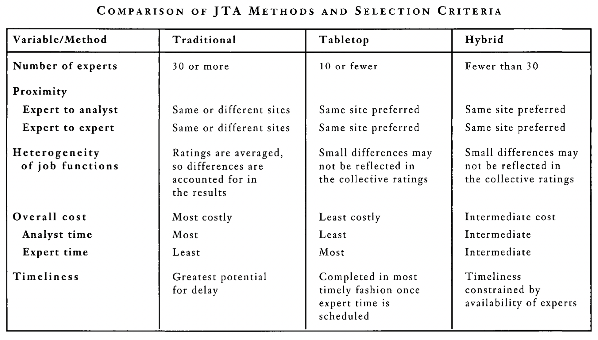

```{r setup, include=FALSE}
usethis::use_git_ignore(c("*.csv", "*.rds"))
options(htmltools.dir.version = FALSE)

library(knitr)
library(tidyverse)
library(xaringan)
library(fontawesome)
```

class: inverse, center, middle

# `r fa("fas fa-images", fill = "#fff")`

**View the slides:** 

[bretsw.com/eme5601-fs24-module5](https://bretsw.com/eme5601-fs24-module5)

---

class: inverse, center, middle

# `r fa("fas fa-person-circle-question", fill = "#fff")` <br><br> Module 4 <br> Recap

---

# `r fa("fas fa-person-circle-question", fill = "#fff")` Needs Assessment

Needs assessment is the **first step** in an iterative design cycle:

```{r, out.width = "480px", echo = FALSE, fig.align = "center"}
include_graphics("img/Rothwell-fig2-1.png")
```

<div class="caption">
Figure 2.1 from Rothwell et al. (2016, p. 20)
<br><br>
</div>

---

class: inverse, center, middle

# `r fa("fas fa-arrows-left-right-to-line", fill = "#fff")` <br><br> Gap = <br><br> [What is] - [What should be]

---

# `r fa("fas fa-person-circle-question", fill = "#fff")` Needs Assessment

```{r, out.width = "100%", echo = FALSE, fig.align = "center"}
include_graphics("img/across-time.jpg")
```

--

- Direct + Indirect Costs

--

- Timeline + Labor

---

# `r fa("fas fa-person-circle-question", fill = "#fff")` Needs Assessment

```{r, out.width = "720px", echo = FALSE, fig.align = "center"}
include_graphics("img/blooms-verbs.png")
```

### Writing Objectives

- Use Bloom's Taxonomy action verbs ([worksheet](https://www.utica.edu/academic/Assessment/new/Blooms%20Taxonomy%20-%20Best.pdf))

---

# `r fa("fas fa-person-circle-question", fill = "#fff")` Needs Assessment

```{r, out.width = "400px", echo = FALSE, fig.align = "center"}

```

### Calculating Sample Size

- Use a sample size [calculator](https://www.qualtrics.com/blog/calculating-sample-size/)


---

class: inverse, center, middle

#  `r fa("fas fa-utensils", fill = "#fff")` <br><br> Module 5 <br> Work Analysis

---

# `r fa("fas fa-utensils", fill = "#fff")` Work Analysis

```{r, out.width = "720px", echo = FALSE, fig.align = "center"}

```

### What is the work of a chef?

---

# `r fa("fas fa-utensils", fill = "#fff")` Work Analysis

```{r, out.width = "720px", echo = FALSE, fig.align = "center"}

```

### What is the work of a chef? (I thought I wanted to be a chef.)

---

# `r fa("fas fa-utensils", fill = "#fff")` Work Analysis

<iframe width="100%" height="480" src="https://www.youtube.com/embed/AzQ3Xso7sLA?si=_E54zVnuzktJo5KP" title="YouTube video player" frameborder="0" allow="accelerometer; autoplay; clipboard-write; encrypted-media; gyroscope; picture-in-picture; web-share" allowfullscreen></iframe>

See: https://www.indeed.com/career-advice/career-development/task-analysis


---

class: inverse, center, middle

# `r fa("fas fa-utensils", fill = "#fff")` <br><br> Performing Work Analysis

Rothwell & Kazanas, 2008 (Ch. 7)

---

# `r fa("fas fa-utensils", fill = "#fff")` Work Analysis

```{r, out.width = "480px", echo = FALSE, fig.align = "center"}

```

<div class="caption">
Figure 7.1from Rothwell & Kazanas (2008, p. 131)
<br><br>
</div>

---

# `r fa("fas fa-utensils", fill = "#fff")` Work Analysis

```{r, out.width = "640px", echo = FALSE, fig.align = "center"}

```

<div class="caption">
Table 7.2 from Rothwell & Kazanas (2008, p. 149)
<br><br>
</div>

--

<hr>

### `r fa("far fa-comments", fill = "#782F40")` Discuss in groups...

---

# `r fa("fas fa-utensils", fill = "#fff")` Work Analysis

```{r, out.width = "600px", echo = FALSE, fig.align = "center"}

```

--

- **Job Analysis:** systematic examination of what people do, how they do it, and what results they achieve by doing it

--

  - Clarifies work titles, responsibilities, activities, and entry qualifications

---

# `r fa("fas fa-utensils", fill = "#fff")` Work Analysis

```{r, out.width = "600px", echo = FALSE, fig.align = "center"}

```

- **Task Analysis:** intensive examination of how people perform work activities

--

  - Clarifies competent performance; which activities might be simplified or improved; what workers must know, do, or feel to learn a specific activity, conditions needed for competent performance; minimum expectations (i.e., standards)

---

# `r fa("fas fa-utensils", fill = "#fff")` Work Analysis

```{r, out.width = "600px", echo = FALSE, fig.align = "center"}

```

- **Content Analysis:** examination of knowledge, skills, and attitudes to identify instructionally useful units (subject matter analysis)

--

  - Clarifies which topics or ideas should be included or excluded in instruction as well as how to sequence topics in instruction
  
---

# `r fa("fas fa-utensils", fill = "#fff")` Why Work Analysis?

```{r, out.width = "100%", echo = FALSE, fig.align = "center"}
include_graphics("img/Rothwell+Kazanas-fig7-2.png")
```

<div class="caption">
Figure 7.2 from Rothwell & Kazanas (2008, p. 152)
<br><br>
</div>

--

- Create or update position descriptions

--

- Develop relevant and useful training

--

- Develop competency models


---

class: inverse, center, middle

# `r fa("fas fa-utensils", fill = "#fff")` <br><br> Job-Task Analysis: Which Way?

Hahn et al., 1995

---

# `r fa("fas fa-utensils", fill = "#fff")` Job-Task Analysis

```{r, out.width = "420px", echo = FALSE, fig.align = "center"}

```

--

**Traditional JTA**

--

- Create task list

--

- Interview those performing the work or their supervisors

--

- Create questionnaire

--

- Administer survey to all subject matter experts (both workers and supervisors)

--

- Analyze frequency, difficulty, importance, and consequences of the task

---

# `r fa("fas fa-utensils", fill = "#fff")` Job-Task Analysis

```{r, out.width = "420px", echo = FALSE, fig.align = "center"}

```

**Tabletop (TTA)**

--

- Facilitator guides a small team of experts during round-robin (i.e., tabletop) discussions to obtain information about a particular job

--

- No prior task list

--

- The team brainstorms and selects tasks for training using a qualitative approach

--

- Sort into training categories based on frequency, difficulty, importance, and consequences

---

# `r fa("fas fa-utensils", fill = "#fff")` Job-Task Analysis

```{r, out.width = "420px", echo = FALSE, fig.align = "center"}

```

**Hybrid JTA**

--

- Develop task list based on work-related materials

--

- Workers and supervisors review and modify the task list during a facilitated roundtable discussion

--

- Participants come to consensus decisions on task ratings

--

- If time permits, iterate the process: participants review the task list independently after the group consensus, potentially soliciting the opinion of other experts

---

# `r fa("fas fa-utensils", fill = "#fff")` Job-Task Analysis

```{r, out.width = "100%", echo = FALSE, fig.align = "center"}
include_graphics("img/Hahn+et+al-fig1.png")
```

<div class="caption">
Figure 1 from Hahn et al. (1995, p. 24)
<br><br>
</div>

---

# `r fa("fas fa-utensils", fill = "#fff")` Job-Task Analysis

```{r, out.width = "100%", echo = FALSE, fig.align = "center"}

```

<div class="caption">
Table 1 from Hahn et al. (1995, p. 27)
<br><br>
</div>


---

class: inverse, center, middle

# `r fa("fas fa-utensils", fill = "#fff")` <br><br> Review of Methods <br> to Identify the Critical Job-Tasks <br> Undertaken by <br> the Emergency Services 

Nevola et al., 2019

---

# `r fa("fas fa-utensils", fill = "#fff")` Identify Critical Job-Tasks

```{r, out.width = "240px", echo = FALSE, fig.align = "center"}

```

--

**Process of Job-Task Analysis:**

--

- Stage 1: Establish the critical job-tasks (i.e. job- analysis)

--

- Stage2: Determine the method of best practice for undertaking the critical job-tasks


--

- Stage 3: Agree the criteria-for, and acceptable minimum level of, job-task performance

--

- Stage 4: Determine the physical demands of the critical job-tasks

--

- Stage 5: Determine a reasonable maximum permissible relative workload

--

- Stage 6: Production of a valid minimum occupational fitness standard

---

# `r fa("fas fa-utensils", fill = "#fff")` Identify Critical Job-Tasks

```{r, out.width = "240px", echo = FALSE, fig.align = "center"}

```

**Insights from the Job-Task Analysis for Emergency Services:**

--

- Maintain robust and **accessible information** with which to describe their critical job-tasks

--

- Adopt a consistent approach (i.e. international standardization) to the development of **performance standards** which accurately reflect the combination of competencies required to safely and successfully conduct critical job-tasks

--

- Implement **employment standards** which incorporate the requirements of job-tasks that have been assessed to be critical to both present and likely future operational scenarios (e.g. informed by techniques such as wargaming).


---

class: inverse, center, middle

# `r fa("fas fa-utensils", fill = "#fff")` <br><br> Practice

---

# `r fa("fas fa-utensils", fill = "#fff")` Job Analysis Practice

```{r, out.width = "720px", echo = FALSE, fig.align = "center"}

```

### `r fa("far fa-comments", fill = "#782F40")` Discuss in groups...

**Describe your first job.**

---

# `r fa("fas fa-utensils", fill = "#fff")` Task Analysis Practice

```{r, out.width = "600px", echo = FALSE, fig.align = "center"}

```

### `r fa("far fa-comments", fill = "#782F40")` Discuss in groups...

**Describe a task in the Innovation Hub.**

---

# `r fa("fas fa-utensils", fill = "#fff")` Work Analysis Practice

```{r, out.width = "520px", echo = FALSE, fig.align = "center"}

```

### `r fa("far fa-comments", fill = "#782F40")` What do you think your professors do?

- Job analysis

- Task analysis

- Content analysis


---

class: inverse, center, middle

# `r fa("fas fa-toolbox", fill = "#fff")` <br><br> Expanding the <br> ISD Analysis Toolbox

---

# `r fa("fas fa-toolbox", fill = "#fff")` ISD Analysis Toolbox

```{r, out.width = "360px", echo = FALSE, fig.align = "center"}
include_graphics("img/toolbench.jpg")
```

- Systems Analysis
- Performance Analysis
- Needs Assessment / Needs Analysis
- Training Requirements Analysis
- Root Cause Analysis
- Competency Assessment
- Learner Assessment
- Setting Analysis
- Developmental Setting Assessment
- **Job Analysis**
- **Task Analysis**
- **Content (Subject Matter) Analysis**

---

class: inverse, center, middle

# `r fa("fas fa-binoculars", fill = "#fff")` <br><br> Looking ahead

---

# `r fa("fas fa-calendar-day", fill = "#fff")` Semester Schedule

```{r, out.width = "480px", echo = FALSE, fig.align = "center"}
include_graphics("img/across-time.jpg")
```

- **Module 1:** Introduction to Instructional Systems Design

- **Module 2:** Systems Analysis

- **Module 3:** ISD & HPT

- **Module 4:** Needs Assessment

- **Module 5: Work Analysis**

- **Module 6:** Design & Development

- **Module 7:** Evaluation

---

# `r fa("far fa-keyboard", fill = "#fff")` Major Assignments

```{r, out.width = "320px", echo = FALSE, fig.align = "center"}
include_graphics("img/build.jpg")
```

- **Assignments** (70%)

  - Module 2 Assignment: Systems Analysis paper (150 points)

  - Module 3 Assignment: Annotated Bibliography 1 (50 points)

  - Module 4 Assignment: Needs Assessment paper (150 points)

  - **Module 5 Assignment: Annotated Bibliography 2 (50 points)**

  - Module 6 Assignment: Work Analysis paper (150 points)

  - Module 7 Assignment: ISD Process Model paper (150 points)

---

# `r fa("far fa-keyboard", fill = "#fff")` Major Assignments

```{r, out.width = "320px", echo = FALSE, fig.align = "center"}
include_graphics("img/build.jpg")
```

`r fa("fas fa-lightbulb", fill = "#782F40")` **Invitation:** Approach the *Module 5 Assignment: Annotated Bibliography 2* a bit differently

--

`r fa("fas fa-book-open", fill = "#782F40")` Start with an article that is a bit over your head to read, such as [Frank et al. (2023)](https://doi.org/10.1016/j.ssresearch.2022.102815)

--

`r fa("fas fa-robot", fill = "#782F40")` Use a little GenAI magic from Google's [NotebookLM](https://notebooklm.google.com/)

--

`r fa("fas fa-podcast", fill = "#782F40")` Listen to the recording at [konfound-it.org](https://konfound-it.org/)

--

`r fa("fas fa-pencil", fill = "#782F40")` Write your annotated bibliography as a reflection on what you found interesting from the NotebookLM summary.

---


class: inverse, center, middle

# `r fa("fas fa-question", fill = "#fff")` <br><br> Questions

<hr>

**What questions can I answer for you now?**

**How can I support you this week?**

<hr>

`r fa("fas fa-envelope", fill = "#fff")` [bret.staudtwillet@fsu.edu](mailto:bret.staudtwillet@fsu.edu) | `r fa("fas fa-globe", fill = "#fff")` [bretsw.com](https://bretsw.com) | `r fa("fab fa-github", fill = "#fff")` [GitHub](https://github.com/bretsw/)